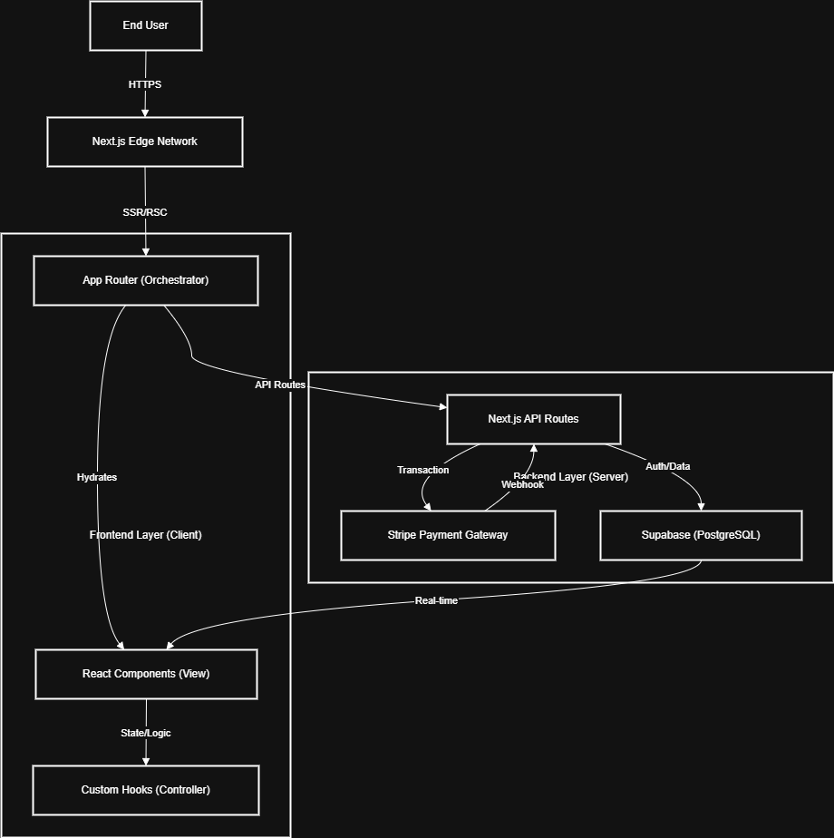

# 🍰 Sugar And Icing

<div align="center">


**A high-performance, component-based e-commerce architecture designed for artisanal bakeries.**

[](https://nextjs.org/)
[](https://www.typescriptlang.org/)
[](https://stripe.com/)
[](https://supabase.com/)

[View Demo](#) • [Report Bug](#) • [Request Feature](#)

</div>

## 📖 About The Project

**Sugar And Icing** is not just a bakery website; it is an engineered e-commerce solution built to demonstrate a strict **Component-Based Structure (CBS)**. Unlike traditional monolithic frontends, this project decouples business logic (Hooks) from presentation layers (Components), ensuring enterprise-grade maintainability and scalability.

Designed with **performance** and **security** first, it leverages the Next.js 16 App Router for server-side optimization and Supabase for robust data integrity with Row Level Security (RLS).

## 🏗️ Architecture Design

The system follows a modern **Serverless/Edge** architecture, utilizing Next.js as the orchestrator for both frontend UI and backend API routes.



## 🚀 Key Features

### 1. Enterprise Component-Based Architecture (CBS)
A strict architectural pattern that separates "Orchestrator Pages," "Atomic View Components," and "Logic Hooks." This ensures zero logical coupling in UI layers, making the codebase highly testable and modular.

### 2. Secure Payment Orchestration
Integrated **Stripe Payment Elements** with server-side validation. The checkout flow handles intent creation, client secret management, and secure webhook validation to ensure PCI compliance and transactional integrity.

### 3. Full-Stack Order Lifecycle Management
End-to-end order processing utilizing **Supabase Row Level Security (RLS)**. User sessions are protected via JWT, ensuring that order history, profile data, and cart states are cryptographically secure and isolated per user.

## 📺 Usage / Demo

> [!NOTE] 
> *Full video walkthrough coming soon!*

[](https://your-youtube-link-here)

## 🛠️ Built With

*   **Framework**: Next.js 16 (App Router)
*   **Language**: TypeScript (Strict Mode)
*   **Styling**: Tailwind CSS 4 & Framer Motion
*   **Database & Auth**: Supabase
*   **Payments**: Stripe

## 🏁 Getting Started

1.  **Clone the repository**
    ```bash
    git clone https://github.com/Kashfmh/Sugar-And-Icing.git
    ```
2.  **Install dependencies**
    ```bash
    npm install
    ```
3.  **Set up environment variables**
    
    Copy the example environment file:
    ```bash
    cp .env.example .env.local
    ```
    Then open `.env.local` and fill in your Supabase and Stripe API keys.

4.  **Set up Database (Supabase)**
    
    Run the following SQL script in your Supabase SQL Editor to initialize the database schema:

    <details>
    <summary>Click to view Database Schema SQL</summary>

    ```sql
    -- 1. Enable UUID Extension
    CREATE EXTENSION IF NOT EXISTS "uuid-ossp";

    -- 2. Core Tables
    CREATE TABLE public.categories (
      id uuid NOT NULL DEFAULT uuid_generate_v4(),
      name text NOT NULL UNIQUE,
      description text,
      display_order integer DEFAULT 0,
      created_at timestamp with time zone DEFAULT now(),
      CONSTRAINT categories_pkey PRIMARY KEY (id)
    );

    CREATE TABLE public.products (
      id uuid NOT NULL DEFAULT uuid_generate_v4(),
      name text NOT NULL,
      description text,
      category_id uuid REFERENCES public.categories(id),
      product_type text NOT NULL CHECK (product_type = ANY (ARRAY['cake', 'cupcake', 'cupcake_basic', 'cupcake_premium', 'brownie', 'fruitcake', 'bread', 'other'])),
      size_variant text,
      base_price numeric NOT NULL,
      premium_price numeric,
      image_url text,
      customizable boolean DEFAULT false,
      min_notice_days integer DEFAULT 0,
      stock_quantity integer,
      times_sold integer DEFAULT 0,
      average_rating numeric DEFAULT 0,
      review_count integer DEFAULT 0,
      is_available boolean DEFAULT true,
      tags text[],
      gallery_images text[],
      created_at timestamp with time zone DEFAULT now(),
      updated_at timestamp with time zone DEFAULT now(),
      CONSTRAINT products_pkey PRIMARY KEY (id)
    );

    CREATE TABLE public.product_options (
      id uuid NOT NULL DEFAULT uuid_generate_v4(),
      product_type text NOT NULL,
      option_category text NOT NULL CHECK (option_category = ANY (ARRAY['base', 'frosting', 'topping', 'dietary'])),
      option_name text NOT NULL,
      is_premium boolean DEFAULT false,
      price_modifier numeric DEFAULT 0,
      description text,
      created_at timestamp with time zone DEFAULT now(),
      CONSTRAINT product_options_pkey PRIMARY KEY (id)
    );

    -- 3. User Profiles & Auth
    CREATE TABLE public.profiles (
      id uuid NOT NULL REFERENCES auth.users(id),
      first_name text,
      last_name text,
      phone text,
      default_delivery_address text,
      dob date,
      default_address_id uuid,
      preferred_contact_method text DEFAULT 'whatsapp' CHECK (preferred_contact_method = ANY (ARRAY['whatsapp', 'email', 'phone'])),
      favorite_flavors text[],
      dietary_restrictions text[],
      notification_preferences jsonb DEFAULT '{"marketing": false, "reminders": true, "order_updates": true}'::jsonb,
      avatar_url text,
      created_at timestamp with time zone DEFAULT now(),
      updated_at timestamp with time zone DEFAULT now(),
      CONSTRAINT profiles_pkey PRIMARY KEY (id)
    );

    CREATE TABLE public.addresses (
      id uuid NOT NULL DEFAULT gen_random_uuid(),
      user_id uuid REFERENCES auth.users(id),
      label text NOT NULL,
      address_line1 text NOT NULL,
      address_line2 text,
      city text NOT NULL,
      state text NOT NULL,
      postcode text NOT NULL,
      is_default boolean DEFAULT false,
      created_at timestamp with time zone DEFAULT now(),
      updated_at timestamp with time zone DEFAULT now(),
      CONSTRAINT addresses_pkey PRIMARY KEY (id)
    );

    -- 4. Orders & Cart
    CREATE TABLE public.orders (
      id uuid NOT NULL DEFAULT gen_random_uuid(),
      user_id uuid REFERENCES auth.users(id),
      guest_info jsonb,
      status text NOT NULL DEFAULT 'pending_verification',
      total_amount numeric NOT NULL,
      receipt_url text,
      delivery_date timestamp with time zone,
      delivery_slot text,
      created_at timestamp with time zone NOT NULL DEFAULT timezone('utc'::text, now()),
      CONSTRAINT orders_pkey PRIMARY KEY (id)
    );

    CREATE TABLE public.order_items (
      id uuid NOT NULL DEFAULT gen_random_uuid(),
      order_id uuid NOT NULL REFERENCES public.orders(id),
      product_id uuid REFERENCES public.products(id),
      product_name text NOT NULL,
      quantity integer NOT NULL DEFAULT 1,
      price_at_purchase numeric NOT NULL,
      metadata jsonb,
      CONSTRAINT order_items_pkey PRIMARY KEY (id)
    );

    CREATE TABLE public.cart_items (
      id uuid NOT NULL DEFAULT uuid_generate_v4(),
      user_id uuid REFERENCES auth.users(id),
      product_id uuid REFERENCES public.products(id),
      quantity integer NOT NULL CHECK (quantity > 0),
      unit_price numeric NOT NULL DEFAULT 0,
      metadata jsonb DEFAULT '{}'::jsonb,
      created_at timestamp with time zone DEFAULT now(),
      updated_at timestamp with time zone DEFAULT now(),
      CONSTRAINT cart_items_pkey PRIMARY KEY (id)
    );

    -- 5. Social Features
    CREATE TABLE public.reviews (
      id uuid NOT NULL DEFAULT uuid_generate_v4(),
      product_id uuid NOT NULL REFERENCES public.products(id),
      user_id uuid NOT NULL REFERENCES public.profiles(id),
      order_id uuid,
      rating integer NOT NULL CHECK (rating >= 1 AND rating <= 5),
      comment text,
      images text[],
      is_verified_purchase boolean DEFAULT true,
      helpful_count integer DEFAULT 0,
      created_at timestamp with time zone DEFAULT now(),
      updated_at timestamp with time zone DEFAULT now(),
      CONSTRAINT reviews_pkey PRIMARY KEY (id)
    );

    CREATE TABLE public.notifications (
      id uuid NOT NULL DEFAULT gen_random_uuid(),
      user_id uuid NOT NULL REFERENCES public.profiles(id),
      title text NOT NULL,
      message text NOT NULL,
      type text NOT NULL CHECK (type = ANY (ARRAY['order', 'system', 'promo'])),
      read boolean NOT NULL DEFAULT false,
      created_at timestamp with time zone NOT NULL DEFAULT timezone('utc'::text, now()),
      CONSTRAINT notifications_pkey PRIMARY KEY (id)
    );

    CREATE TABLE public.special_occasions (
      id uuid NOT NULL DEFAULT gen_random_uuid(),
      user_id uuid REFERENCES auth.users(id),
      name text NOT NULL,
      date date NOT NULL,
      type text,
      reminder_enabled boolean DEFAULT true,
      created_at timestamp with time zone DEFAULT now(),
      updated_at timestamp with time zone DEFAULT now(),
      CONSTRAINT special_occasions_pkey PRIMARY KEY (id)
    );
    ```
    </details>

5.  **Start the development server**
    ```bash
    npm run dev
    ```

## 📄 License

Distributed under the MIT License. See `LICENSE` for more information.

## 📞 Contacts

**Kashfmh**  
[](https://github.com/Kashfmh)
[](https://linkedin.com/in/your-linkedin-profile)

<div align="center">
    <br />
    <p><i>Made with strict engineering standards by Kashfmh</i></p>
</div>
